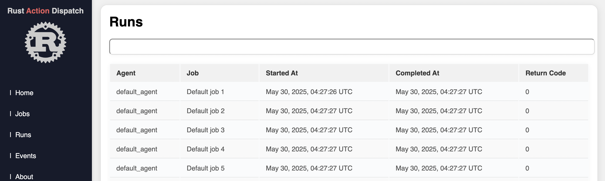

# Rust Action Dispatch

A lightweight Rust library for managing and dispatching actions in your application. Inspired by Redux and Elm architecture, this package helps you organize state changes and side effects in a predictable, testable way.

## Features

- Simple action dispatching and handling
- Centralized state management
- Extensible middleware support
- Designed for both CLI and web applications

## Installation

<Todo>

## Usage

<Todo>

## Contributing

Contributions are welcome! Please open issues or submit pull requests.

## License

MIT License

